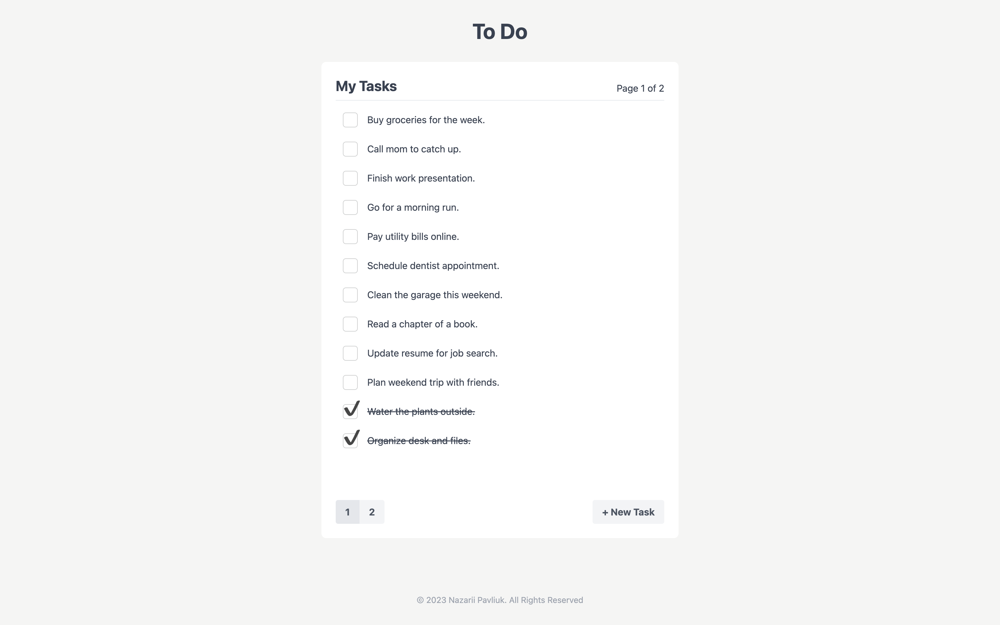

# To do app
This is a simple Todo App developed using Nuxt.js and Vuex, with pagination functionality.

## Features
The Todo App includes the following features:

1. Tasks: You can and removing tasks.
2. Pagination: Displaying 12 task per page.
3. Responsive: Responsive design with Tailwind.

## Setup project
1. Clone the repository from GitHub $ git clone https://github.com/NPavliuk/nuxt-todo.git
2. Install the dependencies using `npm install`.
3. Run the app using `npm run dev`.
4. Navigate to http://localhost:3000 in your browser.

## Technologies

* Vue 2.7.10
* Nuxt 2.15.8
* VueX 3.6.2
* Tailwind 5.3.3
